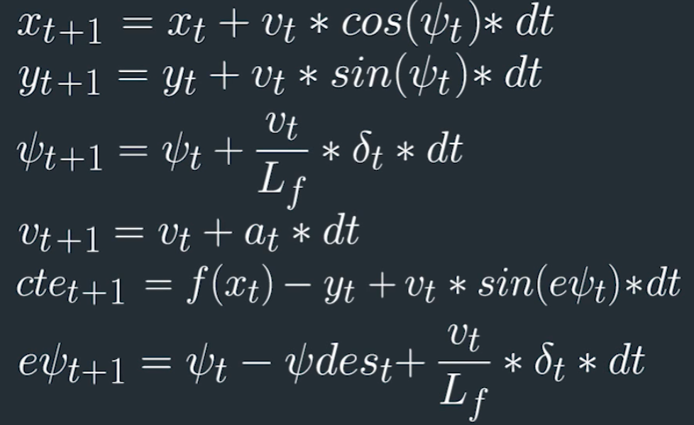

# CarND-Controls-MPC
Self-Driving Car Engineer Nanodegree Program

---

## Dependencies

* cmake >= 3.5
 * All OSes: [click here for installation instructions](https://cmake.org/install/)
* make >= 4.1(mac, linux), 3.81(Windows)
  * Linux: make is installed by default on most Linux distros
  * Mac: [install Xcode command line tools to get make](https://developer.apple.com/xcode/features/)
  * Windows: [Click here for installation instructions](http://gnuwin32.sourceforge.net/packages/make.htm)
* gcc/g++ >= 5.4
  * Linux: gcc / g++ is installed by default on most Linux distros
  * Mac: same deal as make - [install Xcode command line tools]((https://developer.apple.com/xcode/features/)
  * Windows: recommend using [MinGW](http://www.mingw.org/)
* [uWebSockets](https://github.com/uWebSockets/uWebSockets)
  * Run either `install-mac.sh` or `install-ubuntu.sh`.
  * If you install from source, checkout to commit `e94b6e1`, i.e.
    ```
    git clone https://github.com/uWebSockets/uWebSockets
    cd uWebSockets
    git checkout e94b6e1
    ```
    Some function signatures have changed in v0.14.x. See [this PR](https://github.com/udacity/CarND-MPC-Project/pull/3) for more details.

* **Ipopt and CppAD:** Please refer to [this document](https://github.com/udacity/CarND-MPC-Project/blob/master/install_Ipopt_CppAD.md) for installation instructions.
* [Eigen](http://eigen.tuxfamily.org/index.php?title=Main_Page). This is already part of the repo so you shouldn't have to worry about it.
* Simulator. You can download these from the [releases tab](https://github.com/udacity/self-driving-car-sim/releases).
* Not a dependency but read the [DATA.md](./DATA.md) for a description of the data sent back from the simulator.


## Basic Build Instructions

1. Clone this repo.
2. Make a build directory: `mkdir build && cd build`
3. Compile: `cmake .. && make`
4. Run it: `./mpc`.

# [Rubric](https://review.udacity.com/#!/rubrics/896/view) points

## Compilation

### Your code should compile.

The code compiles without errors with cmake and make as described in Basic Build Instructions.  `CMakeLists.txt` was not modified.

## Implementation

### The Model

The model used in the project is a simple global kinematic model that returns the next state vector, given a current state input vector and an actuator vector. The model doesn't include complex interactions of the tires with the road, i.e., it doesn't model dynamics of the vehicle.



The software implementation looks like the following:

```
x[t+1] = x[t] + v[t] * cos(psi[t]) * dt
y[t+1] = y[t] + v[t] * sin(psi[t]) * dt
psi[t+1] = psi[t] + v[t] / Lf * delta[t] * dt
v[t+1] = v[t] + a[t] * dt
cte[t+1] = f(x[t]) - y[t] + v[t] * sin(epsi[t]) * dt
epsi[t+1] = psi[t] - psides[t] + v[t] * delta[t] / Lf * dt
```
where:

`x, y` - car's position coordinates,
`psi` - car's heading direction,
`v` - car's velocity,
`cte` - cross-track error,
`epsi` - error in heading direction

These are considered as inputs of the model, where with the help of `Ipopt` solver and `CppAD` given model's constrains like acceleration and steering angle limits, we can find our optimum control outputs:

`a` - car's acceleration (throttle),
`delta` - steering angle

The control outputs are optimal when the solution minimizes our cost functions which are defined as a sum of squared errors cross-track error, steering angle error, error in reference velocity, errors in use of actuators and the rate of their use.


